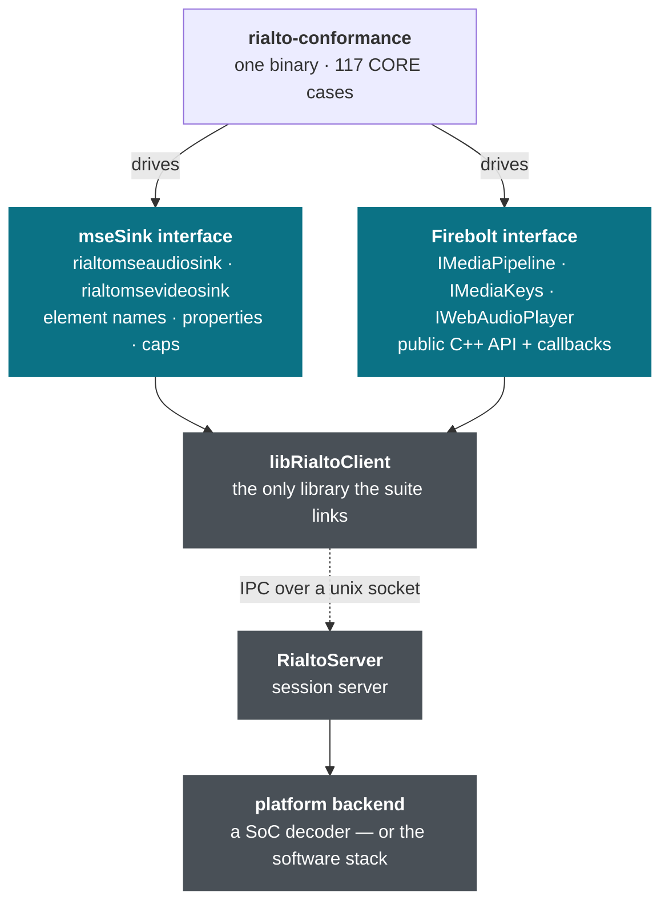
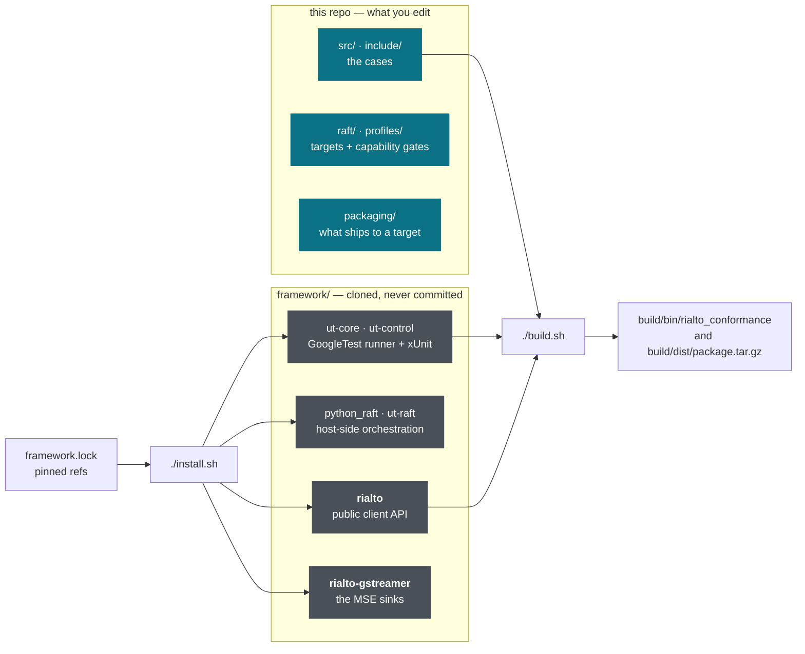
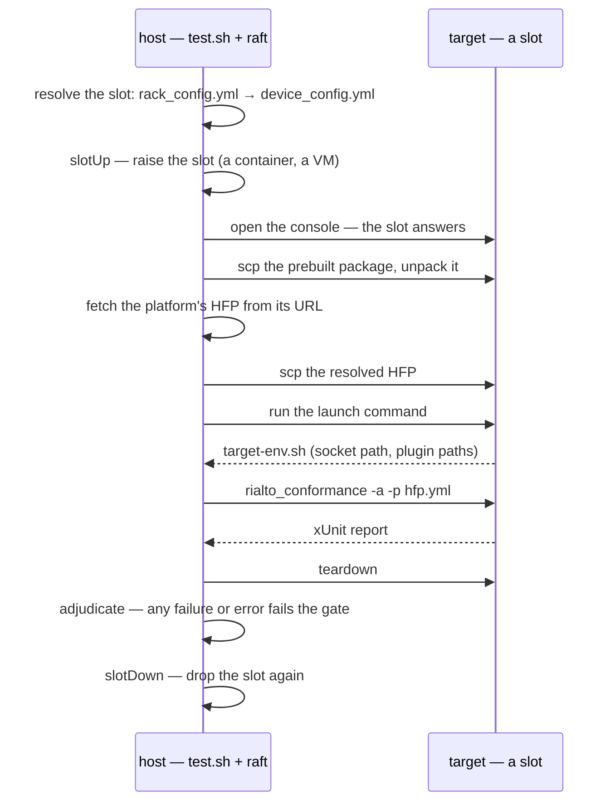
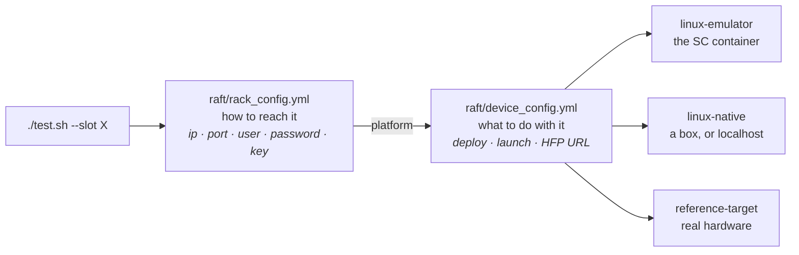

<!--
Copyright 2026 RDK Management

Licensed under the Apache License, Version 2.0 (the "License");
you may not use this file except in compliance with the License.
You may obtain a copy of the License at

    http://www.apache.org/licenses/LICENSE-2.0

Unless required by applicable law or agreed to in writing, software
distributed under the License is distributed on an "AS IS" BASIS,
WITHOUT WARRANTIES OR CONDITIONS OF ANY KIND, either express or implied.
See the License for the specific language governing permissions and
limitations under the License.

SPDX-License-Identifier: Apache-2.0
-->

# rialto-conformance

**A conformance suite for Rialto's two external interfaces.** It behaves like a
media application: it drives the interfaces an app drives, and checks they do
what the requirements say. One binary, one set of cases, the same verdict on
every platform — so a difference between two Rialto builds is a real regression
or an intended change, never a difference in how it was tested.

## What it tests

The suite takes the app's place. Everything below the two interfaces — the
server, the decoder, the SoC — is what is *under* test, never what is tested
directly.



The two interfaces, and only these — never internal wiring:

- **mseSink interface** — the GStreamer sink elements from `rialto-gstreamer`.
- **Firebolt interface** — the public C++ client API from `rialto`, named for its
  `firebolt::rialto` namespace.

A requirement is a source-neutral `RC-*` id owned by this repo
([coverage/rc-core-catalog.yaml](coverage/rc-core-catalog.yaml)); where the same
fact appears on both interfaces it is tested once per interface plus a
consistency case. This is real end-to-end testing against real streams, not a
mock.

## What it uses, and where that lives

Nothing external is committed here. [install.sh](install.sh) clones every
dependency at the exact ref in [framework.lock](framework.lock) into the
gitignored `framework/` directory.



| Pinned at [framework.lock](framework.lock) | Version | What it is |
|---|---|---|
| **ut-core** (`VARIANT=CPP` → GoogleTest) | 5.1.0 | case structure, run modes, xUnit reporting |
| **ut-control** | 2.1.0 | KVP profile engine — reads the capability gate |
| **python_raft** / **ut-raft** | 1.8.2 / 2.1.2 | host-side deploy, run and adjudicate |
| **rialto** | v0.24.0 | the client API the cases are written against |
| **rialto-gstreamer** | v0.22.0 | the sink elements the cases drive |

The suite links **only** `libRialtoClient` and GStreamer. It does not build
Rialto — except on purpose, for the software platform below.

## Quick start — Linux

No hardware, no VM: build the software Rialto and run the whole gate in a
container. Everything missing is bootstrapped on first use (the `sc` tool, the
image, the pinned checkouts).

```bash
./sc-build.sh                        # 1. build the software Rialto + the suite + the package
./test.sh --slot linux-emulator      # 2. run the gate against it
```

Expect `117 cases, 0 failed, 0 errored, 5 skipped`.

Two commands, because bringing the target up and taking it down is part of
running against it: the run raises the container, deploys to it, runs, and drops
it again — as the run's first and last cases, reported like any other. Add
`--keep-slot` to leave it up afterwards.

| Script | What it does |
|---|---|
| [sc-build.sh](sc-build.sh) | builds inside the container: Rialto (software), the suite, the deployable tarball |
| [test.sh](test.sh) | runs the suite against a target, slot lifecycle included. Never builds |
| [emulator.sh](emulator.sh) | `up` \| `down` \| `status` \| `logs` — the container as an ssh-reachable target, by hand |
| [sc-run.sh](sc-run.sh) | the tight dev loop: build + launch + run in one container, no ssh hop |
| [build.sh](build.sh) | builds on this host (needs the toolchain and Rialto's deps present) |
| [build-rialto.sh](build-rialto.sh) | builds the software Rialto itself into a prefix |
| [install.sh](install.sh) | clones the pinned dependencies into `framework/` |

Scope and tier narrow a run: `--scope L1|L2|L3|L4` and `--tier core|extended|all`.

## How a run works

`test.sh` never compiles. It raises the slot, ships a prebuilt package to it,
brings the target environment up, runs the binary there, adjudicates the xUnit
that comes back, and drops the slot again.



The target is only ever a **slot**. The emulator, a Linux box and a real target
run the same binary through the same flow; only the slot changes.

## Working on the Rialto code

Rialto is cloned by `install.sh`, at the ref in `framework.lock`:

```text
framework/rialto              the server, the client library, the public API headers
framework/rialto-gstreamer    the rialtomse{audio,video,text}sink elements
framework/.native-install     where build-rialto.sh installs what it built
```

Both are ordinary git checkouts with their own history and remote, so edit them
in place and rebuild:

```bash
$EDITOR framework/rialto/media/client/main/source/MediaPipeline.cpp
./sc-build.sh                       # rebuilds Rialto, then the suite against it
./test.sh --slot linux-emulator     # does the change still conform?
```

The run makes its own container, so the Rialto you just built is the one it
installs — there is no stale target to remember to replace.

Four things to know before you do:

1. **`install.sh` checks the pinned ref out again on every run**, and `sc-build.sh`
   calls it. Commit your work to a branch in `framework/rialto` before rebuilding,
   or it goes back to the pin. To move the whole project to a new upstream
   version, change `framework.lock` instead.
2. **`build-rialto.sh` overwrites `stubs/opencdm/open_cdm.cpp`** with the backend
   named by `RIALTO_OCDM_BACKEND` (`clearkey` by default, from
   [backends/opencdm/clearkey](backends/opencdm/clearkey)). That file is generated
   — do not edit it in the checkout.
3. **The install prefix must resolve from the system loader path** on whatever
   runs the server. The server manager spawns the session server with `execve` and
   an environment of its own, and sends its stderr to `/dev/null` — so a library it
   cannot find means a server that exits without a word. `emulator.sh` runs
   `ldconfig` for you; on a box, do it yourself (see below).
4. **ut-core does not track header dependencies.** After editing a `.h`, run
   `make clean` or the stale object is relinked.

The suite is written against the *pinned* API. If your change alters the public
interface, the case that asserts it is expected to change with it — that is the
point of the gate.

## Choosing a target

Building and testing are separate jobs: [build.sh](build.sh) compiles and
packages, [test.sh](test.sh) runs. If no package exists, `test.sh` stops and tells
you to build — it will not quietly compile one.

The target is only ever a **slot**:

```bash
./test.sh --slot linux-emulator             # the container (Quick start above)
./test.sh --slot linux-native               # a Linux box — including this one
./test.sh --slot reference-target           # a real target
./test.sh --slot linux-native --scope L1    # one level: full | L1 | L2 | L3 | L4
./test.sh --slot linux-native --tier all    # core | extended | all
./test.sh --slot linux-emulator --keep-slot # leave the slot up when the run ends
```



The emulator slot runs with host networking, so its sshd is on
**127.0.0.1:2222** — loopback only, and port 22 stays yours. Its login user, key
and password are made by the bring-up, which is why that slot needs no
per-engineer editing.

**`linux-native` can just as well be this machine.** Stand the software Rialto up
on it (below), make sure you can `ssh` to `127.0.0.1`, and leave the slot's `ip`
at `127.0.0.1` with your own username. It is a genuine ssh hop to a genuine box —
the same flow a VM or a real target takes.

Point it at another box by editing that slot's four marked console fields in
[raft/rack_config.yml](raft/rack_config.yml) — every slot lives in that one file.
A slot needs both a `password` and a `key`: python_raft's console logs in with
the password, and the adjudicator hands the key to scp, which is how the package,
the HFP and the results move.
The slot's `platform` selects its entry in [raft/device_config.yml](raft/device_config.yml),
which carries the orchestration inputs: how to deploy, where the prebuilt package
is, what to run to bring the target up, and the HFP URL naming that platform's
capability gate. Swapping the box is a config edit, never a test change.

Deployment has two modes, per slot. `deploy: fetch` ships the tarball from
`conformance.package`; `deploy: none` says you installed it on the box yourself
and raft should just run. A target that needs bringing up first names a
`conformance.launch` command — the software platform uses
[packaging/launch-target.sh](packaging/launch-target.sh), which starts the
ServerManagerSim, waits for the session-server socket and hands the resolved
environment to the run via `target-env.sh`. A box already running Rialto leaves
`launch` empty.

A slot that has to be made to exist at all names `conformance.slotUp` and
`conformance.slotDown` as well. Those run on the **host** — the target is not
there yet when `slotUp` runs, and must not be once `slotDown` has — which is what
separates them from `launch` and `teardown`, which run **on** the target. The
emulator names `./emulator.sh up` and `./emulator.sh down`, so a run against it
is a single command; a VM would name whatever boots and shuts it down. A target
that is simply on leaves both empty and nothing about its run changes.

Both are cases of the run, and adjudicated as such: a slot that will not come up
is a failed case with the bring-up's own output attached, not a silent stall
against an address that answers nothing. The slot goes down again whatever the
verdict was — `--keep-slot` is how you stop it and look at what a failure left
behind.

### Standing the software Rialto up on a box

Any Linux box can host the emulator — the sources are public and the build deps
are stock packages:

```bash
./install.sh                                  # clone rialto + rialto-gstreamer at framework.lock
RIALTO_PREFIX=/opt/rialto ./build-rialto.sh   # build + install the software stack
echo /opt/rialto/lib | sudo tee /etc/ld.so.conf.d/rialto.conf && sudo ldconfig
```

The `ldconfig` line is load-bearing. The server manager spawns the session server
with `execve` and an environment of its own, and sends its stderr to `/dev/null`
— so a prefix reachable only through `LD_LIBRARY_PATH` leaves the server exiting
without a word, the app never reaching Active, and every native-surface case
failing for a reason nothing logged.

Then give the box's slot the launch command for it:

```yaml
launch:   "RIALTO_PREFIX=/opt/rialto ./launch-target.sh"
teardown: "./teardown-target.sh"
envFile:  "target-env.sh"
```

To use **this machine** as that box, add your own key to your own
`~/.ssh/authorized_keys` and set a password on the slot, so raft can ssh in the
same way it would to any target:

```bash
ssh-keygen -t ed25519 -f ~/.ssh/rialto-native -N ""
cat ~/.ssh/rialto-native.pub >> ~/.ssh/authorized_keys
ssh -i ~/.ssh/rialto-native 127.0.0.1 true      # must succeed before raft will
```

Which rows a target promotes, and what to record when one fails, is
[coverage/on-target-promotion-plan.md](coverage/on-target-promotion-plan.md).

## Dev loop on the software platform

The reproducible, root-clean way to build and debug locally is the SC docker flow
— one command that bootstraps anything missing (the `sc` tool, the build-env
image) and runs build → launch → gate inside the container as you:

```bash
./sc-run.sh                                 # CORE gate on the Linux software platform
RIALTO_CONFORMANCE_TIER=all ./sc-run.sh
RIALTO_CONFORMANCE_SCOPE=L1 ./sc-run.sh     # one level
./sc-build.sh                               # build only, for a raft run afterwards
```

This is the *dev loop*, not a second test path: it uses the same `build.sh`, the
same `launch-target.sh` and the same packaged binary that raft uses, without the
ssh hop. For the gate, use `./test.sh --slot linux-emulator` — the same
container, reached as a target, and raised and dropped by the run itself.

## Test levels (scope of test, not platform)

| Level | Group ID | Scope |
|---|---|---|
| **L1** | `UT_TESTS_L1` | function — each public function on its own: return status, params, state machine; sink element/property behaviour + caps |
| **L2** | `UT_TESTS_L2` | module — one module as a whole (load/attach/play/pause/seek/EOS, position, caps) |
| **L3** | `UT_TESTS_L3` | group — subsystems together so a fault is localisable (SVP, playback, DRM group) |
| **L4** | `UT_TESTS_L4` | full-stream E2E — real elementary streams + real DRM; the §5 coverage matrix is the pass/fail |

Run one level with `./test.sh --scope L1` (or `RIALTO_CONFORMANCE_SCOPE=L1` for
the dev loop); `full` is the default. Out-of-scope cases **self-skip and are
reported as skipped**, so a scoped run still shows what it did not exercise —
the same property that makes the capability gate honest. The same cases run
identically on every platform; only the cross-compiler differs.

ut-core's own `-e`/`-d` group flags are **not** the mechanism. ut-core 5.1.0
parses them and `UT_get_test_filter()` builds a correct include list, but in
automated mode the filter is never applied — `runTests()` is a bare
`RUN_ALL_TESTS()` and the filter only marks suites active for the interactive
menu. The `UTTestRunner` constructor then overwrites `GTEST_FLAG(filter)` with
`"-"` unconditionally, so a filter set by `main()` is clobbered too. Scope is
therefore a per-case self-skip in
[include/conformance/ScopeGate.h](include/conformance/ScopeGate.h), invoked from
the tier macros every case already declares.

## Test tiers (what is being conformed to)

Orthogonal to level, every case declares one tier:

| Tier | Meaning |
|---|---|
| **CORE** | interface conformance — derived from the Rialto external interface contract itself ([coverage/rc-core-catalog.yaml](coverage/rc-core-catalog.yaml)). The **drop-in / transform-safety gate**: a new Rialto must uphold the same external contract as the old one. Run first; must be green. |
| **EXTENDED** | app/player-requirement conformance layered on top; provenance lives in the private requirements feed. |

The L1–L4 group ids are ut-core's **level** axis. Tier is a second, independent
axis the suite selects at runtime — a case declares `CONFORMANCE_CORE_TEST()` or
`CONFORMANCE_EXTENDED_TEST()` at the top of its body (the same self-skip idiom as
the capability/release gates), and the active selection is read from the
`RIALTO_CONFORMANCE_TIER` environment variable:

```bash
RIALTO_CONFORMANCE_TIER=core     ./rialto_conformance -a -p hfp.yaml  # the gate
RIALTO_CONFORMANCE_TIER=extended ./rialto_conformance -a -p hfp.yaml
./rialto_conformance -a -p hfp.yaml                                   # both (default)
```

Because tier gating is an in-test skip, it composes with the ut-core level filter
(e.g. `RIALTO_CONFORMANCE_TIER=core ./rialto_conformance -e UT_TESTS_L1`) without
the two contending for the GoogleTest filter.

A requirement (`RC-*` id) is **surface-neutral**. Where the same backend fact is
exposed on both surfaces it is tested **once per path** — a native case and an
MSE case, same id — plus a **consistency** case asserting the two agree. Tests
are never path-agnostic: each case drives exactly one surface as itself.

## Platform applicability is data, not code

One binary, the same cases everywhere. The suite never branches on platform
identity — applicability is a **capability gate** on **platform features**, never
a code fork. The gate is on what the target's *platform* supports/exposes, **not
SoC capability**: a SoC may be capable of something the platform built on it does
not support, and two platforms on one SoC can expose different feature sets — so
there are no per-SoC profiles.

**Only genuinely-variable features are gated.** The standard required surface —
the MSE audio/video/text sinks, the core native interfaces, and baseline
H.264 + AAC — is mandatory and tested **unconditionally**: its absence is a
conformance **failure**, not a skip.

- **End state** — the platform API reports the requirements it exposes; the suite
  reads them at runtime and self-selects its applicable cases.
- **Interim / fallback** — the platform's **HFP** (Hardware Feature Profile; see
  [profiles/hfp.example.yaml](profiles/hfp.example.yaml)) carries the per-platform
  feature toggles under `hfp:`. Cases read them with
  `UT_KVP_PROFILE_GET_BOOL("hfp/<key>")` and self-skip via `UT_IGNORE_TEST()` when
  a feature is off. Retired per backend as each gains dynamic capability
  reporting.

The HFP is platform-specific and platform-owned. The host-only `deviceConfig`
(python_raft shape; see
[profiles/deviceConfig.example.yaml](profiles/deviceConfig.example.yaml)) names it
by URL (`conformance.hfp`); the host fetches it and loads it into the on-target
binary with `-p`, and the target never reads deviceConfig.

Adding a target adds one host-only `deviceConfig` (named by config) pointing at
that platform's HFP, and a `raft/` entry — **no new test code**.

## Layout

```text
install.sh            install pinned framework deps (framework.lock) into framework/
build.sh · Makefile   build VARIANT=CPP; link only libRialtoClient + GStreamer
test.sh               run against a slot — never builds
build-rialto.sh       build the software Rialto into a prefix (opt-in)
sc-build.sh           build in the SC container · sc-run.sh  dev loop in the SC container
emulator.sh           the SC container as the linux-emulator target (up/down/status/logs);
                      test.sh calls it as that slot's slotUp/slotDown
docker/               Dockerfile helpers: sc-exec.sh (enter the container) + bring-up scripts
framework.lock        pinned versions of ut-core / ut-raft / rialto API reference
include/conformance/  CapabilityGate.h · RialtoRelease.h · TierGate.h · MediaFeed.h · Surfaces.h
src/                  main.cpp + L1_function/ L2_module/ L3_group/ L4_e2e/ (native/ + mse/)
coverage/             matrix.yaml + requirements/ (gitignored private-feed mount)
profiles/             deviceConfig.schema.yaml + deviceConfig.example.yaml  (capability gate)
raft/                 rack_config.yml · device_config.yml · suites/  (deploy/run/adjudicate)
packaging/            package.sh — bundle binary + profiles + raft scripts
framework/            install.sh target — ut-core/ut-control/ut-raft/rialto (NOT committed)
```

## Certification model

The suite targets a specific **Rialto release** — the [framework.lock](framework.lock)
pin (`targetRialtoRelease`, currently **v0.24.0**) — and passing it certifies a
backend at that release. A requirement may declare a `since:` release; on a target
running an older Rialto it self-skips (`CONFORMANCE_REQUIRE_SINCE`), so a backend
is never failed by a requirement for an interface it predates. (This is release
targeting — *not* Rialto's binary ABI, which is fixed per release.) The versioned
`coverage/matrix.yaml` is the traceability record: "Rialto @ &lt;release&gt; +
backend X meets conformance requirements {RC-…}."

## Licence

Apache-2.0. New files carry the `RDK Management` copyright header.
